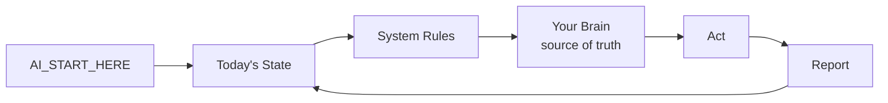

<div align="center">


# JD AI OS — The AI Operating System for Your Life & Business

### Turn any AI (Claude, ChatGPT, Gemini) into a personal chief-of-staff that actually knows you.

**A structured "second brain" + execution engine that any AI can plug into and operate from — on your own machine, under your control.**

[](https://jdproductions.io)
[](CHANGELOG.md)
[](LICENSE)
[](https://github.com/jdwhite0/jd-ai-operating-system/stargazers)

*Producing the future with AI. By JD Productions.*

⭐ **Star this repo** to follow the build — and never lose track of the AI OS movement.

</div>

---

## 🤔 The Problem

You're using AI every day — but every conversation starts from zero.

- It doesn't know your goals, your finances, your projects, or how you work.
- You re-explain yourself constantly.
- Your knowledge is scattered across notes, chats, and your head.
- Switch from ChatGPT to Claude and you start over *again*.

AI is incredible. But without **structure and memory**, it's a brilliant intern with amnesia.

## 💡 The Solution: an AI Operating System

**JD AI OS** is a folder-based operating system for your life that lives on *your* machine. It gives any AI a single place to:

1. **Orient** — read who you are, your priorities, and today's focus.
2. **Operate** — follow consistent rules, no matter which AI is driving.
3. **Remember** — pull from one source of truth instead of guessing.
4. **Execute** — drive your real projects, finances, health, and content forward.

> One brain. Any AI. Total control. No subscriptions to a black box — it's *your* files.

---

## 🎯 What You're Really Getting

JD AI OS isn't a template you download. It's a **capability transfer** — the operating
system behind real ventures, handed to you.

- **You gain leverage.** One person running like a team, because AI finally has the context to act.
- **You gain consistency.** Your standards, encoded once, applied by every AI, every time.
- **You gain compounding.** Every session makes the next one smarter. Nothing is re-explained.
- **You gain ownership.** It's your files, your machine, your brain — forever. No lock-in.

This is the difference between *using AI* and *operating with an AI system*.

---

## ⚙️ How It Works — The Core Loop



Any AI you connect reads one boot file, checks your current state, follows your rules, pulls truth from your brain, acts, and reports back. Same behavior from Claude, ChatGPT, Gemini, or whatever comes next.

---

## 🗂️ The Architecture

```
YOUR OS/
├── AI_START_HERE.md     # universal boot file — orients ANY AI in 2 minutes
├── CLAUDE.md            # auto-loads in Claude Code
├── 01_BRAIN/            # 🧠 source of truth — identity, priorities, life domains
├── 02_SYSTEMS/          # ⚙️ operating rules every AI follows
├── 03_DAILY/            # ❤️ today.md — the heartbeat (your state + tasks)
├── 04_PROJECTS/         # 🚀 active work & future ventures
├── 05_MEDIA/            # 🎬 raw / exports / archive
├── 06_RESOURCES/        # 📚 your reference libraries
├── 07_AUTOMATIONS/      # 🤖 scripts that run the system
└── 08_BACKUPS/          # 💾 snapshots of the irreplaceable parts
```

📖 Full breakdown → [`docs/ARCHITECTURE.md`](docs/ARCHITECTURE.md)

---

## ✨ Why People Use It

| Without JD AI OS | With JD AI OS |
|------------------|---------------|
| Re-explain yourself every chat | AI already knows you |
| Knowledge scattered everywhere | One source of truth |
| Different AIs, different results | Consistent rules across every AI |
| AI gives generic advice | AI acts on *your* real data |
| Locked into one platform | Your files, your machine, forever |

---

## 🚀 Start Free → Scale to the Full System

We want you to **feel it work before you ever pay.** So the framework is free. The full
power is the product.

### 🆓 Free Starter — *the skeleton*
The bones of the system: the folder architecture, the universal AI boot file, and starter
templates. Clone it, point your AI at it, and watch it start operating from your real life.
**This is the taste.** It proves the model in an afternoon.

> 🦴 The skeleton shows you the shape. It works — but it's *you* doing the building.

### 💎 JD AI OS — Full Product — *the machine* *(paid)*
This is where the real value lives. The complete, robust, done-for-you system:

- The **full template library** — every brain, system, and domain file, battle-tested.
- The **JD AI System Optimizer** — point it at a messy machine; it rebuilds it into a clean AI OS.
- **Domain playbooks** — finances, health, real estate, content — pre-loaded intelligence.
- **Automations** — daily rollover, backups, media sorting, running on their own.
- **Setup support** — get it live on your machine, correctly, fast.

> ⚙️ The machine does the building *for* you — and runs itself once it's on.

**The free starter answers "does this work?" The full product answers "how far can I go?"**

👉 **[Get the full system at jdproductions.io →](https://jdproductions.io)**

📋 Full free-vs-paid breakdown → [`docs/WHATS_INCLUDED.md`](docs/WHATS_INCLUDED.md)

---

## 🌍 Who It's For

- **Founders & solopreneurs** running multiple ventures
- **Creators** managing content pipelines across platforms
- **Investors & operators** who want AI working on real numbers
- **Anyone** who wants AI to actually *know them* and help them execute

---

## 🛣️ Roadmap

- [x] v1.0 — Core framework, the AI loop, brain + systems architecture
- [ ] Free starter template repo
- [ ] JD AI System Optimizer (one-command setup)
- [ ] Domain playbook library (finance, health, real estate, content)
- [ ] Automations pack (daily rollover, backups, media sorting)
- [ ] Multi-AI sync & handoff tooling

See [`CHANGELOG.md`](CHANGELOG.md) for releases.

---

## 🌌 The Vision

The next decade belongs to the people who don't just *use* AI — they **operate with it.**

JD AI OS is building the standard for how a person runs their entire life and business
alongside intelligent systems: one owned brain, any AI, total leverage. We're starting with
individuals and creators. We're building toward families, teams, and companies that all run
on the same operating system.

**This is v1.** Star the repo and you're early to the standard.

*Producing the future with AI. — JD Productions*

---

## 💬 FAQ

**Is my data private?** Yes — it's plain files on your machine. No cloud lock-in. → [`docs/FAQ.md`](docs/FAQ.md)
**Which AI does it work with?** Any. Claude, ChatGPT, Gemini, local models — anything you connect.
**Do I need to code?** No.

---

<div align="center">

### ⭐ If this is the future you want to build, star the repo.

**[⭐ Star](https://github.com/jdwhite0/jd-ai-operating-system) · [🌐 Website](https://jdproductions.io) · [📖 Docs](docs/)**

*JD AI OS — Producing the future with AI. © JD Productions. All rights reserved.*

</div>
