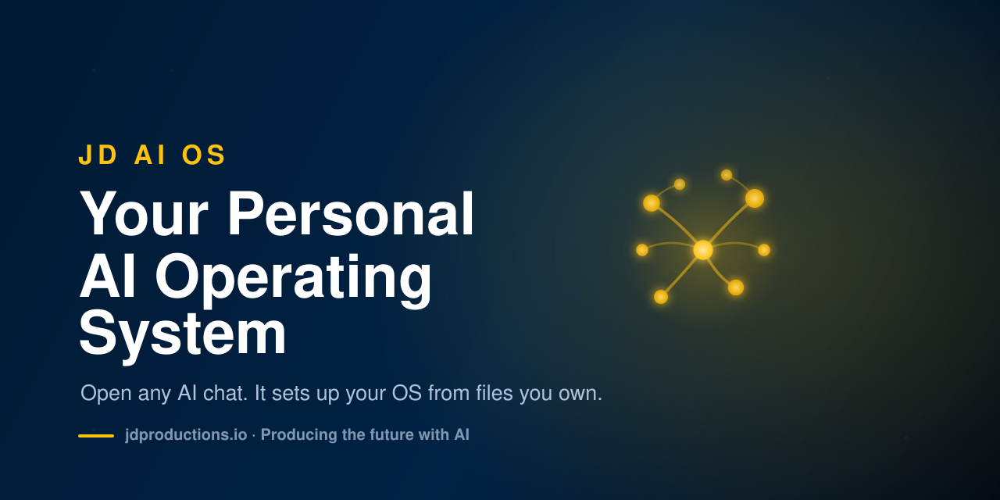

<div align="center">



<br/>

# JD AI OS

### A personal operating system on top of your device OS — open source, any LLM.

**GitHub + Vercel required. EgoLite for agent web. Your files. Your rules.**

[](https://jdproductions.io)
[](CHANGELOG.md)
[](LICENSE)
[](https://github.com/jdwhite0/jd-ai-operating-system/stargazers)

⭐ **Star this repo** after you create GitHub — part of first-run, not an afterthought.

</div>

---

## What this is

**JD AI OS** is a universal open-source **personal OS** that sits on Apple, Windows, or Linux. You retrieve it from GitHub in any LLM chat. The model installs a sequenced toolchain, walks you through accounts, interviews you briefly, and writes your personal `os/` — then operates from it.

It is **not** a blank notes skeleton. It is **not** someone else’s private company vault.

## Start here (humans + AIs)

1. Open a chat with **any** LLM (Claude, ChatGPT, Gemini, Cursor, local…).
2. Point it at this repo: https://github.com/jdwhite0/jd-ai-operating-system  
3. Tell it: **Read `BOOT.md` and run first-run.**

That is the product. Everything else supports that path.

| File | Role |
|------|------|
| [`BOOT.md`](BOOT.md) | Universal entry — every model reads this first |
| [`ONBOARDING/FIRST_RUN_SCRIPT.md`](ONBOARDING/FIRST_RUN_SCRIPT.md) | Exact chat playbook |
| [`ONBOARDING/ACCOUNT_SEQUENCE.md`](ONBOARDING/ACCOUNT_SEQUENCE.md) | GitHub → **star** → Vercel |
| [`toolchain/INSTALL_SEQUENCE.yaml`](toolchain/INSTALL_SEQUENCE.yaml) | Ordered installs (no guessing) |
| [`tools/egolite/`](tools/egolite/) | EgoLite — required agent browser |
| [`os/`](os/) | Your personal OS after interview |
| [`deploy/`](deploy/) | Vercel hosted surface |

## Requirements

| Need | Why |
|------|-----|
| **GitHub account** | Repo home, fork/clone, updates |
| **Vercel account** | Deploy the hosted OS surface |
| **Any LLM** | Operator of the OS |
| **EgoLite** | Agent browser for authenticated web work |

## First-run spine

```
Retrieve repo → GitHub → star this repo → Vercel
  → toolchain sequence → EgoLite + tools rack
  → short interview → write os/ → first operate loop
```

UX laws (enforced in `BOOT.md`): never blind, never dump, LLM does heavy work, human gates only for signup/2FA/approvals.

## Architecture

```
jd-ai-operating-system/
├── BOOT.md
├── ONBOARDING/          # playbook, accounts, interview
├── toolchain/           # install order + checks
├── tools/               # tools rack + EgoLite
├── os/                  # personal OS (brain, systems, daily…)
├── deploy/              # Vercel starter
├── docs/                # architecture, FAQ, philosophy
└── starter/             # legacy v1 paths → use os/
```


```mermaid
flowchart LR
    A[BOOT.md] --> B[Accounts + star]
    B --> C[Toolchain]
    C --> D[EgoLite]
    D --> E[Interview → os/]
    E --> F[today.md]
    F --> G[Act + report]
    G --> F
```

## Docs

- [`docs/ARCHITECTURE.md`](docs/ARCHITECTURE.md)
- [`docs/FAQ.md`](docs/FAQ.md)
- [`docs/PHILOSOPHY.md`](docs/PHILOSOPHY.md)
- [`docs/WHATS_INCLUDED.md`](docs/WHATS_INCLUDED.md)

## License

MIT — see [`LICENSE`](LICENSE). Trademark names stay with JD Productions.

---

*Producing the future with AI. By [JD Productions](https://jdproductions.io).*
